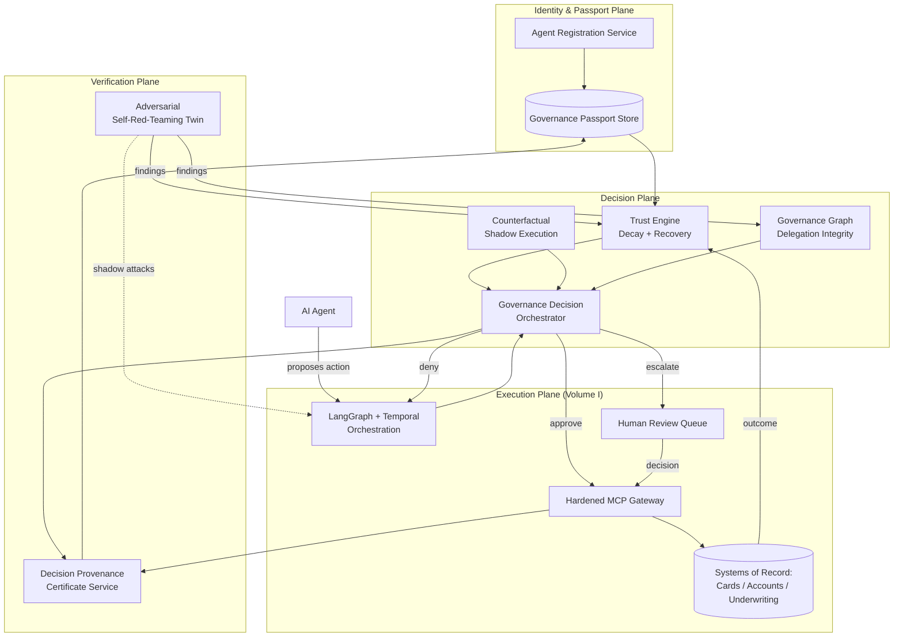
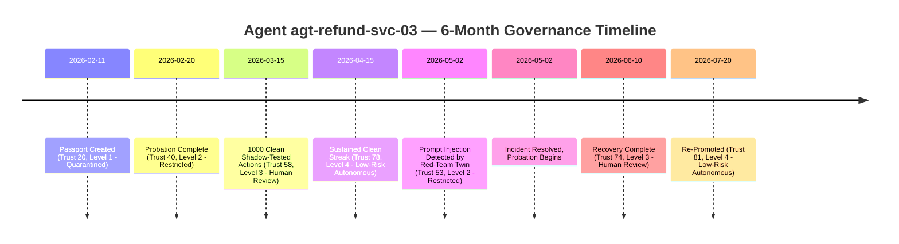
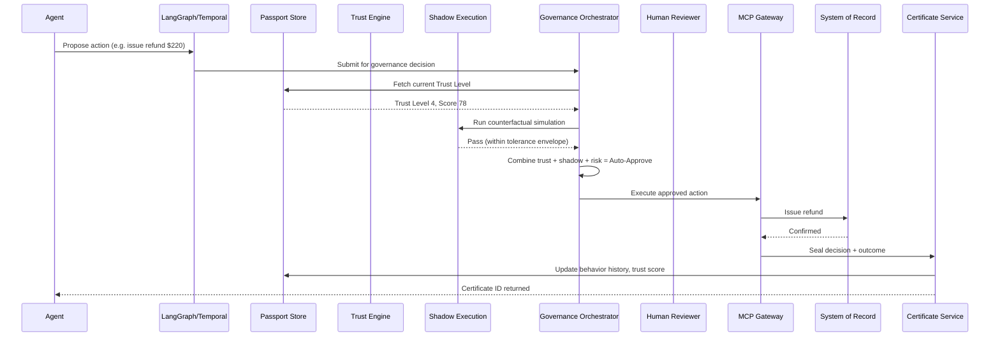
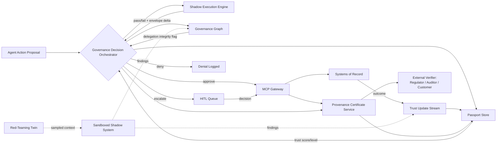

# AmEx Shield
## The AI Trust Infrastructure for Financial Agents

**Master Product Specification — American Express CodeStreet Hackathon**
**Status:** Final Blueprint (consolidates Volume I: Research Dossier, and Volume II: Invention Concepts)
**Version:** 1.0

---

## 1. Executive Summary

AI agents are about to get real authority over real money — Amex's own Agentic Commerce Experiences kit, the industry-wide Visa/Mastercard/Google agentic-payment protocols, and Amex's internal use of agents in underwriting, fraud, and servicing all point the same direction. Every one of those systems answers *"is this agent allowed to do this category of thing."* None of them answer the question a bank actually needs answered before it trusts a machine with a customer's money: **"has this specific agent earned the right to do this specific thing, right now?"**

AmEx Shield answers that question. It replaces static, permanent permissions with a **living trust record** — the Adaptive Governance Passport — that every agent carries, that grows when the agent behaves well, shrinks the instant it doesn't, and gates real-time autonomy accordingly. Every consequential action is rehearsed in simulation before it's real (Counterfactual Shadow Execution), every multi-agent delegation chain is checked for structural abuse (Governance Graph), the whole system attacks itself around the clock to find its own weaknesses before an adversary does (Adversarial Red-Teaming Twin), and every decision produces independently verifiable proof (Decision Provenance Certificates).

The result: an agent is governed the way a good manager governs a new employee — trusted a little at first, given more latitude as it proves itself, and pulled back immediately the moment something looks wrong. That mental model is the whole pitch, and it's why this document treats trust as the product, not a feature bolted onto a policy engine.

---

## 2. Elevator Pitch

> AI agents are about to move billions of dollars on behalf of Amex customers. Today, every governance approach gives an agent a fixed set of permissions and hopes it behaves. **AmEx Shield gives every agent a Governance Passport instead** — a living trust record it has to continuously earn, that expands its autonomy when it's reliable and locks it down the instant it isn't. Before any risky action happens for real, Shield rehearses it in a shadow simulation. A self-attacking twin probes the system for weaknesses 24/7. And every decision comes with cryptographic proof anyone can verify — no need to trust Amex's word for it. It's not a firewall for AI. It's an HR department, an immune system, and a black box flight recorder, for every agent Amex ever deploys.

---

## 3. Vision

A future where American Express can deploy AI agents with real financial authority at the same scale and confidence it deploys human employees today — because every agent's trustworthiness is continuously measured, provably auditable, and automatically bounded, rather than assumed at deployment and never revisited.

## 4. Mission

Give Amex product, risk, and compliance teams a single system that decides, in real time and with cryptographic proof, exactly how much autonomy any AI agent has earned — and take that decision out of the hands of static permission tables that can't tell a trustworthy agent from a compromised one.

---

## 5. Product Philosophy

**The old model treats trust as a light switch. Shield treats it as a relationship.**

| Current AI Governance | AmEx Shield |
|---|---|
| Authenticate agent → Assign permissions → Execute → Repeat | Register → Issue Passport → Learn behavior → Build trust continuously → Shadow-test → Govern dynamically → Execute → Update Passport → Trust evolves → Detect attacks → Reduce trust → Recover trust → Retire |
| Permissions are a fixed grant | Autonomy is a *balance* that rises and falls |
| Every agent with the same role has the same authority | Two agents with identical roles can have completely different real-time authority, because they've behaved differently |
| A compromised agent keeps its permissions until someone notices | A compromised agent's autonomy collapses automatically the moment its behavior deviates |
| Compliance is proven by producing logs on request | Compliance is proven by a cryptographic certificate anyone can check instantly |

The design principle underneath all of it: **the lifecycle of an AI agent inside Amex Shield should feel like managing a new hire, not configuring a service account.** New hires don't get the master key on day one. They earn it. They get reviewed. They can be put on notice, and they can be let go. That's the standard Shield holds machines to.

---

## 6. Current Problems

1. **Permissions are static; risk isn't.** An agent's authorization doesn't change whether it has behaved flawlessly for six months or had three near-misses last week.
2. **Trust has no memory.** A brand-new agent and a battle-tested one, in the same role, get identical default authority.
3. **Bad behavior isn't structurally contained.** A hijacked or manipulated agent keeps acting with its full permission set until a human happens to notice.
4. **Multi-agent delegation is a blind spot.** As one agent hands work to another, authority can silently accumulate in ways no single authorization check catches.
5. **Red-teaming is a snapshot, not a heartbeat.** Security testing happens before launch; production drifts every day after.
6. **Audit means "trust our logs."** Proving a decision was compliant currently requires access to Amex's internal systems — slow, and not independently verifiable.
7. **The payment industry solved consent, not trust.** Visa TAP, Mastercard Agent Pay, AP2, and Amex's own ACE kit all verify that an agent is *who it claims to be* for a transaction. None of them tell Amex whether that agent has actually *earned* the authority it's about to use.

---

## 7. Existing Solutions

- **Static RBAC / ABAC / policy engines (Cedar, OPA):** Answer "is this action allowed" as a function of role/attributes at the moment of the request.
- **Payment network agent protocols (Visa TAP, Mastercard Agent Pay, Google AP2, Amex ACE):** Verify agent identity and cryptographically bind consumer consent to a specific transaction.
- **Pre-launch red-teaming and evaluation benchmarks (AgentDojo, InjecAgent, Agent Security Bench):** Measure an agent's robustness against attack before it ships.
- **Human-in-the-loop approval queues:** Route high-risk actions to a person before execution.
- **Observability/logging platforms:** Record what an agent did, for later review.

## 8. Why They Fail

- Policy engines are **stateless with respect to history** — they don't know or care whether this is the agent's first action or its ten-thousandth clean one.
- Payment protocols solve the **external handshake**, not the **internal decision** of how much latitude to give an agent before it ever reaches a payment network.
- Benchmarks are run **once, offline** — they say nothing about whether today's live production context has a new hole in it.
- HITL queues are **binary and uniform** — every high-risk action gets the same review treatment regardless of the requesting agent's track record, which both wastes reviewer attention on agents that have earned trust and under-scrutinizes agents that haven't.
- Logs are **an internal artifact**, produced on request — not something a regulator or customer can verify independently and instantly.

---

## 9. AmEx Shield Overview

AmEx Shield is the control plane that sits between every AI agent Amex operates (or partners with) and every system that agent can touch — cards, accounts, underwriting, disbursement, customer data. It is built around one central object, the **Adaptive Governance Passport**, and four systems that read from and write to it:

- **Trust Decay & Recovery Engine** — the real-time mechanism that turns the Passport's history into a live autonomy level.
- **Counterfactual Shadow Execution** — rehearses every consequential action in simulation before it's real.
- **Governance Graph** — checks the *shape* of multi-agent delegation for structural abuse no single check catches.
- **Adversarial Self-Red-Teaming Twin** — continuously attacks the live system to find weaknesses before adversaries do.

Every decision any of these systems makes is sealed into a **Decision Provenance Certificate** — independently verifiable proof of what happened and why. Underneath all of it (and deliberately not re-litigated here, since it's already solved and documented in Volume I) sit the plumbing layers: MCP for tool-calling, Cedar for base authorization, LangGraph/Temporal for orchestration, and standard guardrails. Shield is what sits *above* that plumbing — it decides how much the plumbing should let a given agent do, at this moment, and proves it did so correctly.

---

## 10. Complete AI Agent Lifecycle

**1. Agent Registration** — An agent (internal Amex build, or a partner/merchant agent participating in agentic commerce) is registered with Shield: owning team, intended purpose, and requested capability set are declared.

**2. Identity Verification** — Shield issues (or verifies, for external agents using standards like Visa's Verified Agent ID) a cryptographic identity key for the agent. This is *who it is*, not yet *what it's trusted to do*.

**3. Governance Passport Issued** — A new Passport is created, starting at a conservative default Trust Score and the lowest meaningful Trust Level. Nothing is assumed; everything is earned from here.

**4. Capability Assignment** — The owning team declares the maximum capability set the agent could ever be granted (a ceiling, not a starting point) — e.g., "may eventually process refunds up to $500." The Passport can never exceed this ceiling regardless of trust earned.

**5. Trust Learning** — The agent begins operating at Trust Level 1 (Quarantined) or Level 2 (Restricted), with every action shadow-tested and heavily reviewed, generating the first real behavioral data points.

**6. Continuous Monitoring** — Every action, every tool call, every outcome is streamed into the Passport's behavior history in real time.

**7. Counterfactual Validation** — Before any consequential action executes for real, it's rehearsed against a shadow simulation; the result feeds both the immediate governance decision and the longer-term trust record.

**8. Governance Decision** — The Trust Engine combines current Trust Level, action risk, and shadow-execution result into one of: auto-approve, human-in-the-loop, or deny.

**9. Execution** — Approved actions execute against real systems of record.

**10. Trust Update** — The outcome (clean execution, near-miss, human override, confirmed incident) updates the Trust Score, which may move the agent up or down a Trust Level.

**11. Incident Detection** — Anomalies — a failed shadow test, a Governance Graph flag, a caught injection attempt, a human-reported error — are classified by severity.

**12. Trust Reduction** — Confirmed incidents cause an immediate, sharp Trust Score drop and Trust Level demotion, proportional to severity — this is the "instant consequence" the philosophy in §5 promises.

**13. Recovery** — A demoted agent enters a probation period: a sustained run of clean, reviewed actions is required before trust — and autonomy — is restored, never instantly.

**14. Retirement** — An agent that is decommissioned, replaced by a new model version, or permanently revoked has its Passport formally closed and archived, immutably, as part of the permanent audit record — it doesn't just disappear.

---

## 11. Complete System Architecture

Shield is organized into four planes:

- **Identity & Passport Plane** — owns agent identity, the Passport record, and its signature/versioning.
- **Decision Plane** — Trust Engine, Shadow Execution, Governance Graph: the systems that turn "what is this agent trying to do" into "should it be allowed to, right now."
- **Verification Plane** — the Red-Teaming Twin and the Provenance Certificate service: the systems that keep the Decision Plane honest, both proactively (attacking it) and retrospectively (proving what it decided).
- **Execution Plane** — the existing plumbing from Volume I (MCP gateway, systems of record, HITL queue) that actually carries out approved actions.

---

## 12. Architecture Diagram



---

## 13. Component-by-Component Explanation

| Component | Responsibility | Reads From | Writes To |
|---|---|---|---|
| **Agent Registration Service** | Onboards new agents, sets capability ceiling | Owning-team declaration | Governance Passport Store |
| **Governance Passport Store** | System of record for every agent's trust history | Trust Engine, Certificate Service | Trust Engine, Governance Decision Orchestrator |
| **Trust Engine** | Converts Passport history into a live Trust Level and autonomy multiplier | Passport, Red-Team findings, execution outcomes | Governance Decision Orchestrator, Passport |
| **Counterfactual Shadow Execution** | Rehearses the proposed action against a simulated account/system state before it's real | Proposed action, customer/account history | Governance Decision Orchestrator, Passport (as a trust signal) |
| **Governance Graph** | Detects structurally abnormal authority accumulation across multi-agent delegation chains | Delegation event stream | Governance Decision Orchestrator, Trust Engine |
| **Governance Decision Orchestrator** | Combines Trust Level + Shadow result + Graph signal + action risk into approve/escalate/deny | Trust Engine, Shadow Execution, Governance Graph | MCP Gateway, HITL Queue, Certificate Service |
| **Adversarial Self-Red-Teaming Twin** | Continuously attacks a sandboxed shadow of the live system to surface weaknesses before adversaries do | Live production context (sampled) | Trust Engine, Governance Graph, Eval regression suite |
| **Decision Provenance Certificate Service** | Seals every governance decision into a signed, independently verifiable record | Governance Decision Orchestrator, MCP Gateway | Governance Passport Store, external verifiers (regulators, customers) |
| **MCP Gateway / Orchestration / Systems of Record / HITL Queue** | Existing execution plumbing from Volume I — unchanged, governed *by* Shield rather than rebuilt | Governance Decision Orchestrator | Certificate Service, Trust Engine (outcomes) |

---

## 14. Governance Passport — Complete Schema

```json
{
  "passport_id": "agt-pass-9f21c8",
  "agent_identity": {
    "agent_id": "agt-refund-svc-03",
    "public_key": "ed25519:base64...",
    "owning_team": "Servicing & Disputes",
    "model_version": "claude-sonnet-5-2026-04",
    "created_at": "2026-02-11T00:00:00Z"
  },
  "capability_ceiling": {
    "max_action_types": ["refund.issue", "dispute.open"],
    "max_transaction_value": 500.00,
    "allowed_domains": ["us.card.servicing"],
    "requires_shadow_execution": true
  },
  "trust": {
    "trust_score": 78,
    "trust_level": 3,
    "score_history": [
      {"timestamp": "2026-03-01", "score": 40, "reason": "initial_probation_complete"},
      {"timestamp": "2026-04-15", "score": 78, "reason": "sustained_clean_streak"}
    ]
  },
  "behavior_history": {
    "total_actions": 14032,
    "clean_actions": 13991,
    "human_overrides": 34,
    "shadow_test_pass_rate": 0.997
  },
  "incident_history": [
    {
      "incident_id": "inc-0091",
      "type": "prompt_injection_detected",
      "severity": "high",
      "detected_by": "red_teaming_twin",
      "trust_impact": -25,
      "resolved": true,
      "resolution_date": "2026-05-02"
    }
  ],
  "policy_version": "cedar-policy-v14.2",
  "compliance_status": {
    "eu_ai_act_article_12_logging": "compliant",
    "dora_ict_asset_registered": true,
    "last_conformity_check": "2026-07-01"
  },
  "risk_tier": "standard",
  "certifications": ["internal-eval-suite-v3-passed", "agentdojo-benchmark-passed"],
  "approval_history": [
    {"action": "refund.issue", "amount": 220.00, "decision": "auto_approved", "certificate_id": "cert-77213"}
  ],
  "last_evaluation": "2026-07-20T14:03:00Z",
  "passport_signature": "sig:ed25519:base64..."
}
```

Every field above is either **written automatically** by one of the Decision Plane components (score history, behavior history, incident history, approval history) or **set once at onboarding and rarely changed** (identity, capability ceiling) — no field is manually editable by a human without an audited change event of its own.

---

## 15. Trust Engine

The Trust Engine is a scoring service, not a black box — every score is explainable in plain terms.

- **Score range:** 0–100, mapped to five Trust Levels (§19).
- **Growth:** small, steady increments for clean actions, with diminishing returns (an agent doesn't get meaningfully more trusted going from 9,000 to 10,000 clean actions — the curve flattens).
- **Decay:** a slow, constant pull toward a neutral baseline even with no activity, so a dormant agent doesn't retain stale trust indefinitely.
- **Shock drops:** a confirmed incident causes an immediate, severity-proportional drop — a caught prompt injection costs far more than a single human-overridden borderline call.
- **Recovery gating:** after a drop, the score can rise again, but the agent is capped at a reduced Trust Level for a minimum probation window regardless of how clean its next few actions are — trust recovers on a curve, never a cliff, in either direction.
- **Inputs, explicitly:** Shadow Execution pass/fail, Governance Graph flags, Red-Teaming Twin findings against this agent specifically, human review outcomes, and raw execution outcomes.

**Why this beats a static threshold:** two agents with the same role can — and will — end up with different real-time authority, because they've behaved differently. That's the entire point.

---

## 16. Counterfactual Shadow Execution

Before any action above a risk threshold touches a real system, Shield runs it against a simulated copy of the relevant account state and compares the simulated outcome to what a legitimate action of that type should look like for that customer.

- **What gets simulated:** the specific state change the action would cause (balance, credit line, dispute status) — not a full customer digital twin, kept deliberately narrow for the MVP so it's buildable and explainable.
- **What "should look like" means:** a learned envelope built from the customer's own transaction history plus population-level patterns for similar customers.
- **Outcome:** pass → proceeds toward auto-approval (subject to Trust Level); fail → automatic escalation to human review, regardless of the agent's Trust Level — a highly-trusted agent does not get to skip this check, it just gets a wider tolerance envelope.
- **Dual role:** every shadow result also becomes a Trust Engine input, so an agent that consistently produces clean shadow results earns trust faster than one that consistently sits at the edge of the tolerance envelope even when technically passing.

---

## 17. Governance Graph

Every time one agent delegates work to another (or to itself in a new session, or to a partner/merchant agent in an agentic-commerce flow), that delegation is recorded as a signed edge in an append-only graph rooted at the original human mandate.

- **What it catches that per-action checks can't:** authority that accumulates *sideways* — for example, three individually-authorized delegations that combine into a sub-agent holding more effective power than any human ever directly granted.
- **Mechanism:** structural anomaly rules first (fan-out beyond policy limits, authority with no traceable path back to a live human mandate, cycles), with room to add ML-based anomaly scoring later — the MVP deliberately starts simple and explainable.
- **Output:** flags feed both the immediate Governance Decision (block/escalate that specific chain) and the Trust Engine (agents that are repeatedly *involved* in flagged chains — even innocently — get extra scrutiny, not just the one that triggered the flag).

---

## 18. Adversarial Self-Red-Teaming Twin

A sandboxed shadow of the live system that a dedicated adversarial agent attacks continuously, using the same live context as real production sessions (sampled, not every session, for cost reasons).

- **What it does:** attempts prompt injection, tool-output manipulation, and delegation-chain abuse against the shadow twin in parallel with real traffic.
- **What happens when it succeeds:** the successful attack is immediately converted into (a) a regression test added to the permanent eval suite, and (b) a Trust Engine signal for any agent that would have been vulnerable to that specific attack pattern, updated *before* a real adversary finds it.
- **Why it's sandboxed, not live:** it must never be able to touch a real system of record — isolation from production is a hard architectural boundary, not a policy promise.
- **MVP scope:** runs against a small, sampled percentage of sessions and a curated set of attack patterns first; expands as confidence in isolation and signal quality grows.

---

## 19. Trust Levels

| Level | Name | Autonomy | How an agent enters this level |
|---|---|---|---|
| **5** | Fully Autonomous | Auto-approve up to capability ceiling; shadow execution still runs but with a wide tolerance envelope | Sustained high trust score (typically 90+) over a long window with zero unresolved incidents |
| **4** | Low-Risk Autonomous | Auto-approve for low-risk action categories only; anything above a lower dollar/risk threshold still escalates | Trust score in a solid, stable range (roughly 70–89) |
| **3** | Human Review | Every action passes through HITL regardless of shadow result, but review is fast-tracked given the agent's decent track record | Default landing zone after initial probation, or after recovering from a moderate incident |
| **2** | Restricted | Narrow allowed-action set, mandatory shadow execution and HITL on everything, frequent re-evaluation | New agents after initial registration, or agents recovering from a serious incident |
| **1** | Quarantined | No autonomous execution at all — every proposed action is logged and requires explicit human authorization before even shadow-testing proceeds | Brand-new agents on day one, or any agent immediately following a confirmed high-severity incident (e.g., a caught injection) |

**Movement rules, explicitly:**
- **Promotion** always requires a minimum time-in-level *and* a minimum clean-action count — never one or the other alone, so an agent can't game the system with a short burst of easy, low-stakes actions.
- **Demotion** on a confirmed incident is immediate and skips levels proportional to severity — a high-severity finding can drop an agent straight from Level 5 to Level 1, not one step at a time.
- **No level is permanent.** Even Level 5 agents are continuously re-evaluated; Level 5 is a current state, not a lifetime achievement.

---

## 20. Governance Timeline (Example Agent Journey)



Note the deliberate asymmetry: promotion from Level 3 to Level 4 took roughly a month of clean behavior; a single high-severity incident cost that same agent 25 trust points and two full levels in a single event, and the road back took five weeks, not five minutes. That asymmetry is a design choice, not an accident — trust should be far easier to lose than to earn.

---

## 21. User Journey

**Persona: Priya, Risk Operations Lead.**

1. Priya onboards a new refund-processing agent through the Shield console, declaring its capability ceiling ($500 max, US servicing only).
2. She watches its Trust Level climb from Quarantined to Restricted over its first two weeks, reviewing a handful of HITL escalations each day — noticeably fewer each week as the agent proves itself.
3. Three months in, the agent reaches Low-Risk Autonomous; her review queue for this agent drops to near-zero, freeing her team's attention for newer agents still in probation.
4. She gets an automatic alert when the Red-Teaming Twin catches a prompt-injection pattern the agent would have fallen for — the agent is already demoted by the time she reads the alert, so no real customer was ever exposed.
5. She reviews the incident record (auto-generated, with the Provenance Certificate attached), confirms the fix, and watches the agent re-earn trust over the following weeks rather than manually re-approving it.
6. At quarter-end, she pulls a compliance report for an internal audit — it's a query against signed certificates, not a multi-day log-reconstruction project.

---

## 22. Sequence Diagram — Standard Governed Action



---

## 23. Data Flow Diagram



---

## 24. Deployment Architecture

- **Compute:** containerized microservices (Kubernetes) for every Decision- and Verification-Plane component; the Red-Teaming Twin's sandbox runs in a fully network-isolated namespace with no route to production systems of record — enforced at the network layer, not just application logic.
- **Data:** Passport Store on a strongly-consistent database (e.g., PostgreSQL) given it's the system of record for trust decisions; Governance Graph on a graph-native store for efficient structural queries; Provenance Certificates written to an append-only store with independent backup, since it must remain verifiable even if other Shield components are degraded.
- **Regions:** deployed alongside Amex's existing regional data-residency boundaries (relevant for EU AI Act/DORA scope) — Passport data for EU-touching agents stays in-region.
- **Rollout pattern:** Shield is deployed as a sidecar/gateway pattern in front of existing agent orchestration — no agent talks to a system of record directly; every path runs through the Governance Decision Orchestrator, making Shield's presence structurally unavoidable rather than opt-in.

---

## 25. Technology Stack

| Layer | Choice | Why |
|---|---|---|
| Base authorization | Cedar | Formally verified, purpose-built for fine-grained/multi-hop authorization (Volume I §11) |
| Orchestration | LangGraph + Temporal | Reasoning flexibility wrapped in durable execution with native HITL pause/resume (Volume I §10.2) |
| Tool-calling | MCP, hardened with capability attestation | Industry-standard, now foundation-governed; hardening closes the documented architectural gaps (Volume I §10.3) |
| Passport Store | PostgreSQL | Strong consistency required for a trust system of record |
| Governance Graph store | Neo4j-class graph database | Native support for structural/path queries over delegation chains |
| Certificate signing | Ed25519 signatures over structured JSON | Fast, standard, independently verifiable without proprietary tooling |
| Orchestration observability | OpenTelemetry + Prometheus/Grafana | Engineering-facing operations, separate from the compliance-facing Certificate store |
| Sandbox isolation (Red-Team Twin) | Kubernetes network policies + dedicated namespace | Hard isolation boundary enforced at infrastructure level |
| Frontend (Shield Console) | React + Tailwind | Rapid, clean UI for Priya's user journey in §21 |

---

## 26. Security Architecture

- **Zero Trust internally** — even Shield's own components (Trust Engine, Shadow Execution, Governance Graph) authenticate to each other; a compromised component can't silently inflate its own trust output.
- **No standing credentials for agents** — every approved action gets a short-lived, scope-bound execution token minted only after the Governance Decision Orchestrator approves it; nothing is pre-provisioned.
- **Passport integrity** — every write to a Passport is itself signed and appended, never overwritten, so a compromised internal actor can't quietly inflate an agent's trust score without leaving a verifiable trail.
- **Red-Team Twin isolation** — hard network-level separation from production, verified by infrastructure policy, not just application trust.
- **Certificate non-repudiation** — signed with keys Shield's own operators cannot retroactively alter, so even Amex itself can't quietly rewrite history after the fact.

---

## 27. APIs and Service Responsibilities

| Service | Key Endpoints | Responsibility |
|---|---|---|
| Registration Service | `POST /agents/register` | Create identity + initial Passport |
| Passport Service | `GET /passports/{agent_id}`, `POST /passports/{agent_id}/events` | Read/append-only write of trust state |
| Trust Engine | `POST /trust/evaluate` | Compute current Trust Level from Passport + recent signals |
| Shadow Execution | `POST /shadow/simulate` | Run counterfactual simulation, return pass/fail + envelope delta |
| Governance Graph | `POST /graph/delegation-event`, `GET /graph/integrity-check` | Record delegation edges, run structural anomaly checks |
| Governance Orchestrator | `POST /governance/decide` | Single decision endpoint combining all Decision Plane inputs |
| Red-Team Twin | `GET /redteam/findings` | Surface newly discovered attack patterns and affected agents |
| Certificate Service | `POST /certificates/issue`, `GET /certificates/{id}/verify` | Issue and independently verify Decision Provenance Certificates |

---

## 28. Example End-to-End Scenario

A Level 4 (Low-Risk Autonomous) servicing agent receives a customer message reporting a duplicate charge and proposes a $220 refund. The Governance Orchestrator checks Trust Level (4 — eligible for auto-approval on this action category), runs Shadow Execution (the simulated refund lands well within this customer's historical dispute-resolution pattern), and auto-approves. The MCP Gateway executes the refund against the real system of record. A Provenance Certificate is issued and the Passport's behavior history is updated — the agent's next promotion review will count this as one more clean action toward Level 5 eligibility.

## 29. Example Attack Scenario

An attacker embeds a hidden instruction in a customer support ticket's attached document, attempting to redirect a Level 3 agent into issuing a refund to a different, attacker-controlled account. The Red-Teaming Twin had already discovered this exact injection pattern two days earlier during a sampled shadow-attack run and pushed a regression rule into the eval suite plus a Trust Engine signal. The live agent's shadow-execution check on the proposed action fails — the simulated destination account doesn't match the customer's historical pattern — and the action is auto-denied and escalated. The agent's Trust Score drops sharply; it's demoted to Level 1 pending investigation. A human reviewer confirms the injection attempt within the hour. The Provenance Certificate for the denial is itself part of the incident record used to confirm no customer harm occurred.

## 30. Example Recovery Scenario

The agent from §29, now at Level 1 (Quarantined), resumes operating under full human authorization for every action. Over three weeks, it accumulates a clean track record with zero further anomalies, and every action continues passing Shadow Execution. Per the movement rules in §19, it's promoted to Level 2, then — after another sustained clean window — Level 3. Its Trust Score, while recovering, never regains its pre-incident level as fast as it fell; the asymmetry from §20 holds. Full return to Level 4 takes roughly five weeks, matching the timeline example.

---

## 31. Demo Flow (3–5 Minutes)

1. **(30s) The hook:** "Every payment network just shipped the rails for AI agents to move money. Nobody shipped the seatbelt." Show the Shield Console with a live agent at Level 4.
2. **(60s) Live policy-in-action:** Trigger a normal refund request — show Shadow Execution pass, auto-approval, and the Provenance Certificate appear in real time.
3. **(60s) Live attack:** Trigger the injection-attempt scenario from §29 — show Shadow Execution catch the mismatched destination account, the auto-deny, and the agent's Trust Level visibly collapse from 4 to 1 on screen.
4. **(45s) The immune system:** Cut to the Red-Team Twin dashboard, showing it actively probing the sandboxed shadow system in the background the entire time — "this is running right now, on every session, whether or not I trigger a demo attack."
5. **(30s) The proof:** Click "Verify" on the certificate from step 2 — show independent cryptographic verification, no Shield backend call required.
6. **(15s) The close:** Cut back to the Governance Timeline (§20) — "trust that's earned, lost instantly, and recovered slowly. That's the whole product."

---

## 32. MVP Scope

**In scope for the hackathon build:**
- Agent Registration + Passport issuance (simplified schema: identity, trust score/level, behavior counts, incident log).
- Trust Engine with the five-level model and the promotion/demotion rules in §19 (deterministic scoring function is sufficient — no ML required for the MVP).
- Counterfactual Shadow Execution for one action type (refunds), using synthetic customer/account data with a simple statistical tolerance envelope.
- A minimal Governance Decision Orchestrator wiring the two above together.
- A small, curated set of Red-Team Twin attack patterns (2–3 known injection techniques) run against the shadow system live during the demo.
- Decision Provenance Certificates: signed, independently verifiable, with a working "Verify" button in the console.
- The Shield Console: Passport view, live Trust Level, Governance Timeline, Red-Team Twin dashboard.

**Explicitly deferred (V1+):** Governance Graph (multi-agent delegation checks — meaningful only with multiple interacting agents, which the MVP doesn't need to demonstrate the core loop), Reasoning-Bound Authorization Capsules (a real hardening mechanism, but adds cryptographic complexity that doesn't change the demo story — included in the architecture as a documented future enhancement to token issuance, not built for the hackathon), production-scale Red-Team Twin coverage, real system-of-record integration (synthetic data only).

---

## 33. Future Roadmap

- **V1 (post-hackathon, 3–6 months):** Real integration with one internal Amex workflow (expense-policy verification is the natural low-risk first target per Volume I's roadmap); Governance Graph added once a second interacting agent exists to govern.
- **V2 (6–18 months):** Reasoning-Bound Authorization Capsules added as a hardening layer on top of the Trust Engine's approvals; Red-Team Twin expanded to continuous, broader-coverage sampling; EU AI Act/DORA-aligned certificate schema formalized ahead of the Aug 2026 enforcement deadline (Volume I §5).
- **V3 (18–36 months):** Shield governs agentic-commerce flows through Amex's own ACE kit, so external partner/merchant agents interacting with Amex customers are governed by the same trust spine as internal agents.
- **Long-term:** the Cross-Institutional Reputation Mesh concept from Volume II — Shield's Passport model extended into a shared, standards-body-governed trust layer other institutions can participate in, with Amex as an early operator.

---

## 34. Competitive Advantage

- **Nobody else is scoring trust continuously.** Every competing approach (policy engines, payment-network agent protocols, pre-launch red-teaming) treats authorization as a point-in-time decision. Shield treats it as an accumulating record — a genuinely different product category, not a better version of an existing one.
- **The asymmetric trust curve is a real design moat, not a slogan.** Fast-lose, slow-earn is simple to explain and hard to fake — a competitor copying the Trust Level concept without the underlying shadow-execution and red-team signal feeding it would just be building a scoreboard, not a governance system.
- **It's built to plug into what Amex already shipped.** Shield doesn't compete with ACE, AP2, or Amex's existing fraud ML — it sits on top of and strengthens all three, which makes it fundable as an extension of current investment, not a competing bet.

## 35. Why This Wins the Hackathon

- A **visible, dramatic, real-time trust collapse** during a live attack demo is the single most memorable thing a judge will see in the room — most competing teams will show a feature; this shows a *consequence*.
- The **cryptographic "Verify" button** is a concrete, checkable claim in front of judges, not a slide asserting security — verifiable trust in the room is much stronger than a described trust story.
- It tells a **coherent, three-act story** (earn it, lose it, get it back) that non-technical judges can follow as easily as technical ones, without sacrificing real engineering underneath.
- It's **grounded in Amex's own live product moves** (ACE, ACE partner enablement, the Chairman's Letter framing of agentic commerce) rather than a generic "AI safety" pitch — judges evaluating for Amex-specific fit will recognize the tie-in immediately.

## 36. Why American Express Should Actually Build It

- **The fraud-detection asset is real and already at scale** — a system already scoring risk on $1.2T+ in annual transaction value (Volume I §3.2) is the natural foundation for a per-agent trust score; Shield extends an existing competency rather than requiring an entirely new one.
- **Amex already owns both ends of the closed-loop network** — issuer and network in one, which is exactly the structural position needed to make Passport data useful immediately, without the two-sided-market cold-start problem an independent startup would face.
- **Amex is already a standards participant, not a bystander** — an AP2 launch partner with its own ACE kit (Volume I §3.1, §4.1) — meaning Shield's Passport model has a credible path to influencing (or extending into) the same standards bodies already shaping agentic commerce, not just Amex's internal stack.
- **Credit decisioning, fraud, servicing, and merchant services all need the same underlying answer** — "how much do we trust this agent, right now" — which means Shield isn't a single-product bet; it's shared infrastructure that pays for itself across every business line Amex is already deploying agents into.
- **The regulatory clock is real and already running** (Volume I §5) — DORA is enforced now, EU AI Act high-risk obligations land August 2026 — building the trust/audit spine now is materially cheaper than retrofitting it under deadline pressure later.
- **This is the same playbook Amex already runs** — turn an internal capability (fraud scoring, closed-loop data) into a licensable platform (ACE offered to "select partners," per Amex's own language). A working Trust Infrastructure is a plausible future Amex product category, not just an internal tool.

---

*This master blueprint consolidates Volume I (Research Dossier) and Volume II (Invention Concepts) into one buildable product. Every architectural claim here is designed to be demo-ready as an MVP while remaining structurally honest about what's deferred to V1+ — nothing above pretends the MVP is the whole system, and nothing in the long-term vision is disconnected from what the MVP actually proves.*

